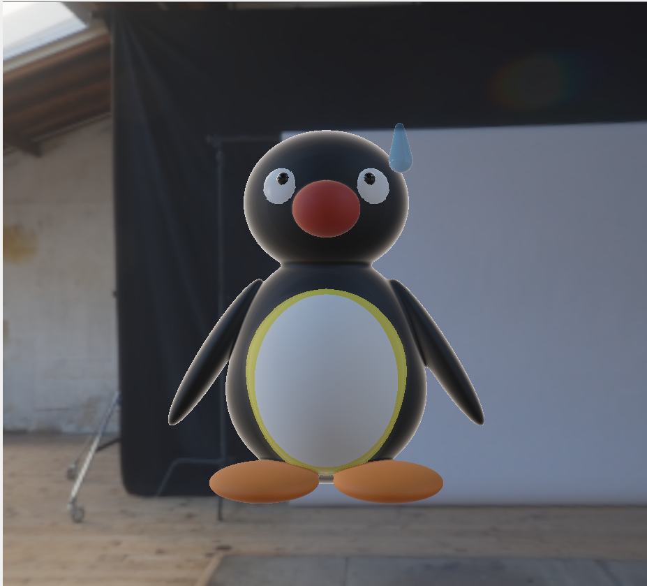
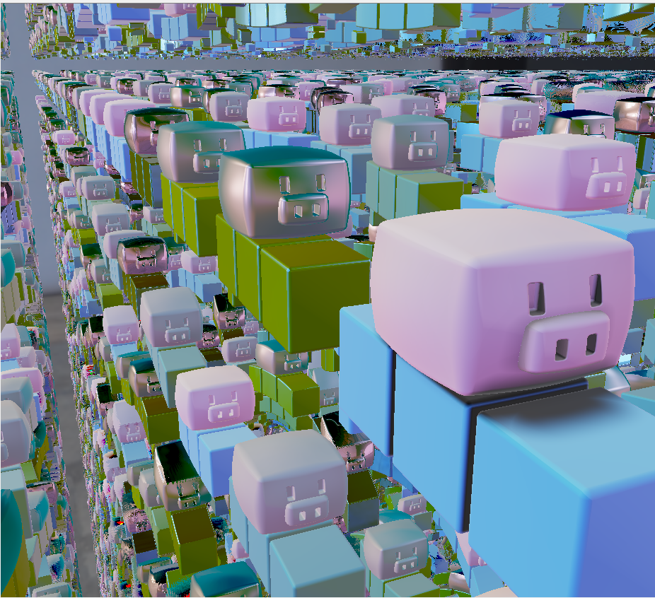
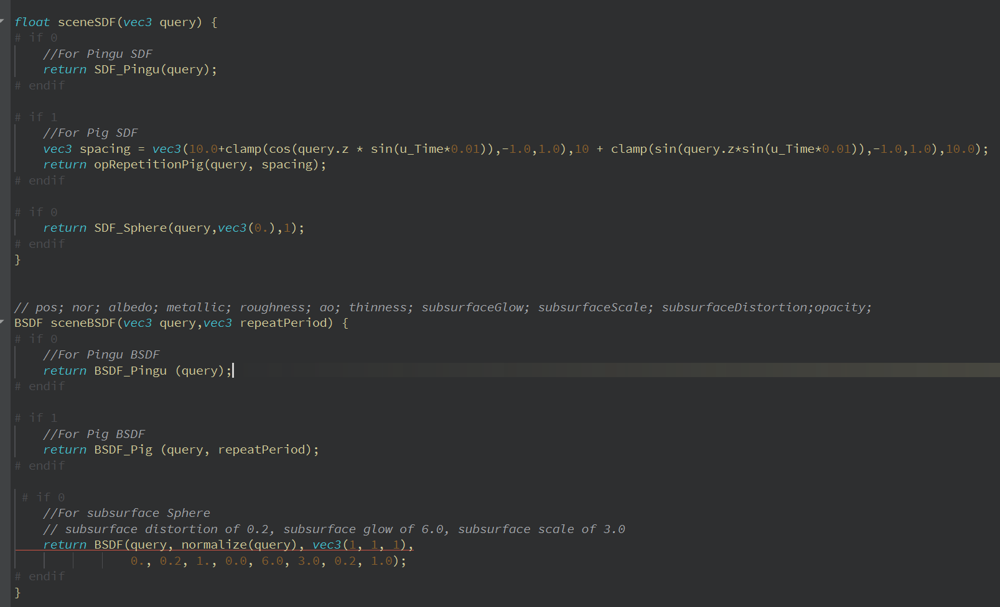

Signed Distance Fields and Subsurface Scattering
======================

My results (All uploaded in result folder)
----------------

Pingu
------------

Videos Link: https://drive.google.com/file/d/1F8uGOLzCBaBVzspWNjRqYkVqmkgA2aEn/view?usp=sharing

Pigs
------------

Video Link: https://drive.google.com/file/d/1LBoxQRjkLIDNTU1cxw-NqJ2RSK_naI8s/view?usp=sharing

Instructions
------------

You can change the #if 0 ---> # if 1 inside the function "sceneSDF" and "sceneBSDF"
in "sdf.defines.glsl" for the scene you want to see. Please make sure there's only 
one #if 1 when you run the program. The following picture is the screenshot of where
the comment #if 0 and #if 1 are.
